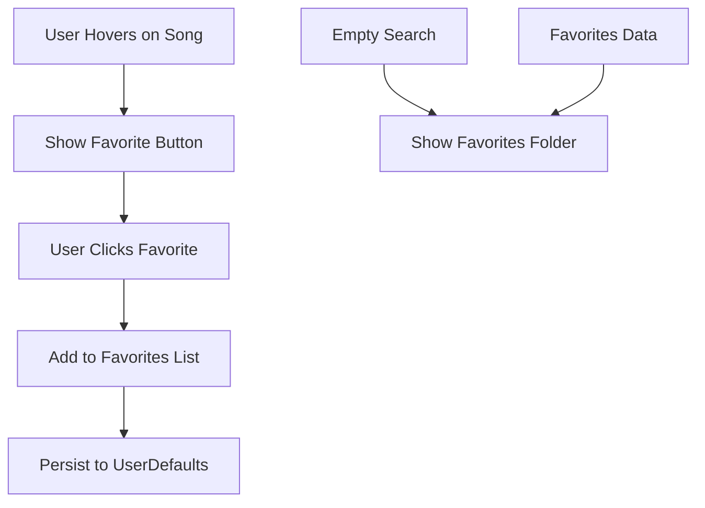

# Add Favorite Button Feature Design

## 1. Overview

This document outlines the design for adding a favorite button feature to the Izzy music player. The feature allows users to mark songs as favorites by hovering over them and clicking a heart icon. These favorites will be displayed in a dedicated folder that appears on the search history/home page when there are no search results.

### Objectives
- Allow users to easily mark songs as favorites
- Provide quick access to favorite songs
- Maintain favorites persistently across app sessions
- Integrate seamlessly with existing UI/UX

### User Experience
- Users can hover over any song in search results to reveal a favorite button
- Clicking the favorite button adds the song to their favorites collection
- When the search bar is empty, the favorites folder is displayed as the primary content
- Users can access their favorites without needing to search

## 2. Architecture

### Component Modifications
- **SearchResultRow**: Add hover state and favorite button
- **MusicSearchManager**: Add favorites management functionality
- **SearchState**: Add favorites display logic
- **SearchResultsView**: Add favorites section display
- **Data Models**: Extend with favorites persistence

### Data Flow


## 3. UI/UX Design

### Favorite Button
- Location: Right side of each SearchResultRow, only visible on hover
- Icon: Heart (outline when not favorited, filled when favorited)
- State: Toggles between favorited/unfavorited on click
- Animation: Smooth transition between states

### Favorites Folder
- Displayed when search text is empty and there are no search results
- Located in the same area as search results
- Shows grid or list of favorite songs
- Each favorite shows the same information as regular search results

### Visual Design
- Favorite button color: Red (#FF3B30) for filled state, gray for outline
- Favorites folder header: "Favorites" with folder icon
- Consistent styling with existing search results

## 4. Data Models

### FavoriteSong Model
```swift
struct FavoriteSong: Identifiable, Codable {
    let id: String
    let title: String
    let artist: String?
    let thumbnailURL: String?
    let duration: TimeInterval?
    let videoId: String
    let addedDate: Date
    
    init(from searchResult: SearchResult) {
        self.id = searchResult.id
        self.title = searchResult.title
        self.artist = searchResult.artist
        self.thumbnailURL = searchResult.thumbnailURL
        self.duration = searchResult.duration
        self.videoId = searchResult.videoId ?? ""
        self.addedDate = Date()
    }
}
```

### Updated SearchState
- Add `@Published var favorites: [FavoriteSong] = []`
- Add methods for adding/removing favorites
- Add persistence methods using UserDefaults

## 5. Implementation Plan

### Phase 1: Data Layer
1. Create FavoriteSong model
2. Add favorites property to SearchState
3. Implement add/remove favorite methods
4. Add persistence using UserDefaults

### Phase 2: UI Components
1. Modify SearchResultRow to show favorite button on hover
2. Implement toggle favorite functionality
3. Create FavoritesView component
4. Modify SearchResultsView to show favorites when appropriate

### Phase 3: Integration
1. Connect favorites data to UI components
2. Implement favorites display on empty search
3. Add animations and transitions
4. Test persistence across app sessions

## 6. API Endpoints

No new API endpoints required. The feature uses existing search and playback APIs.

## 7. Business Logic

### Favorite Management
- Check if song is already favorited before adding
- Maintain favorites list in order of addition (newest first)
- Limit favorites list to reasonable size (e.g., 100 songs)
- Handle duplicate favorites gracefully

### Display Logic
- Show favorites only when search text is empty
- Show empty state message if no favorites exist
- Update favorites display in real-time when changes occur

## 8. Testing

### Unit Tests
- Test adding/removing favorites
- Test favorites persistence
- Test duplicate prevention
- Test edge cases (empty favorites, max limit)

### UI Tests
- Test hover behavior for favorite button
- Test click behavior for adding/removing
- Test display of favorites on empty search
- Test persistence across app restarts

## 9. Performance Considerations

- Favorites list should be limited to prevent performance issues
- Use efficient lookup for checking if song is favorited
- Optimize persistence to avoid blocking UI
- Cache favorite status for quick display updates