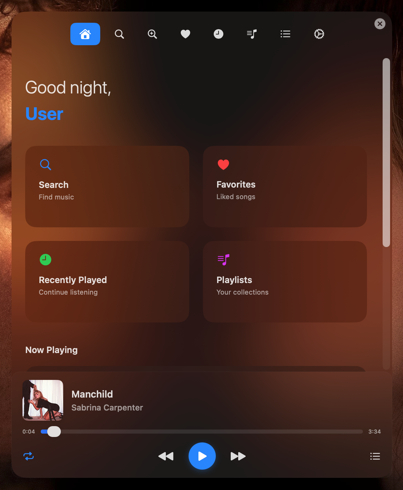

# 🎵 Izzy Music Player

<div align="center">



**A beautiful, modern music player for macOS with YouTube Music & JioSaavn integration**

[](https://www.apple.com/macos/)
[](https://swift.org)
[](LICENSE)
[](https://github.com/ShubhamPP04/Izzy/releases)

</div>

---

## ✨ Features

### 🎸 Dual Music Service Support
- **YouTube Music** - Stream millions of songs from YouTube Music
- **JioSaavn** - Access India's largest music streaming platform
- Seamless switching between services

### 🎯 Core Features
- **Global Hotkey** - Quick access with `Option + Space`
- **Floating Window** - Always-on-top interface for quick music control
- **Menu Bar Integration** - Beautiful, redesigned menu bar player with album artwork
- **Smart Search** - Real-time search with intelligent suggestions
- **AI-Powered Recommendations** - Personalized "For You" section with AI-curated songs based on your listening history
- **Queue Management** - Full control over your playback queue
- **Playlist Support** - Create and manage custom playlists
- **Recently Played** - Track your music history
- **Favorites** - Save your favorite tracks for easy access

### 🎨 Modern Design
- **Glassy UI** - Beautiful glassmorphism design with blur effects
- **Album Artwork** - High-quality album art display
- **Dark Mode** - Elegant dark theme throughout
- **Smooth Animations** - Polished transitions and interactions
- **Responsive Layout** - Optimized for various screen sizes

### 🎛️ Playback Controls
- **Full Playback Control** - Play, pause, next, previous
- **Centered Playback Layout** - Beautifully balanced playback controls with perfectly centered buttons
- **Seek Support** - Click or drag to seek through tracks
- **Media Key Integration** - Native macOS media key support
- **Persistent State** - Resume playback exactly where you left off
- **Volume Control** - Fine-grained volume adjustment with hover indicator

### 🔍 Discovery
- **AI-Powered Search** - Find music using natural language with Gemini AI
- **Intelligent "For You" Section** - Get fresh, personalized recommendations on every refresh
  - Uses Gemini AI to understand your music taste and mood
  - Parallel API calls for ultra-fast refresh (2-4 seconds)
  - Always provides new songs you haven't heard
  - Filters out already played tracks automatically
- **Mood & Genre** - Browse by mood and genre categories
- **Charts** - Explore trending music
- **Song Suggestions** - Discover similar tracks based on what you're listening to
- **Watch Playlist** - Auto-generated radio playlists

### 📱 Additional Features
- **Lyrics Support** - View synchronized lyrics for songs
- **Mini Player** - Compact player window
- **Keyboard Shortcuts** - Full keyboard navigation
- **Background Playback** - Continues playing in background
- **Auto-Updates** - Built-in update mechanism

---

## 🚀 Installation

### Requirements
- macOS 14.0 (Sonoma) or later
- Python 3.13+ (for music service backend)
- Internet connection

### Download

1. **Download the latest release** from the [Releases](https://github.com/ShubhamPP04/Izzy/releases) page
2. **Open the DMG file** and drag Izzy to your Applications folder
3. **Enter this command in terminal** : xattr -rd com.apple.quarantine "/Applications/Izzy.app"
4. **Launch Izzy** from Applications

### First Launch

On first launch, you may see a security prompt:
1. Go to **System Settings** > **Privacy & Security**
2. Click **"Open Anyway"** for Izzy
3. The app will launch and set up Python dependencies automatically

---

## 🛠️ Building from Source

### Prerequisites

```bash
# Install Xcode (from App Store)
xcode-select --install

# Install Python 3.13+
brew install python@3.13

# Clone the repository
git clone https://github.com/ShubhamPP04/Izzy.git
cd Izzy
```

### Setup

```bash
# Run the setup script to create Python virtual environment
chmod +x setup.sh
./setup.sh

# Install Python dependencies
pip install -r requirements.txt
```

### Build

```bash
# Open the project in Xcode
open Izzy.xcodeproj

# Build and run from Xcode
# Or use command line:
xcodebuild -project Izzy.xcodeproj -scheme Izzy -configuration Release build
```

### Create DMG

```bash
# Build a distributable DMG
chmod +x build_dmg.sh
./build_dmg.sh
```

---

## 📖 Usage

### Global Hotkey
Press `Option + Space` anywhere on your Mac to open/close Izzy

### Search for Music
1. Type in the search bar
2. Select a song, album, artist, or playlist
3. Click to play or add to queue

### Switch Music Services
1. Open **Settings** (⚙️ icon)
2. Select **YouTube Music** or **JioSaavn**
3. Service will switch immediately

### Create Playlists
1. Navigate to **Library** > **Playlists**
2. Click **"Create Playlist"**
3. Add songs by clicking the **+** button on any track

### AI Search
1. Click the **AI Search** button (✨)
2. Describe the music you want in natural language
3. Example: "upbeat workout music" or "relaxing jazz for study"

### AI-Powered Recommendations
1. Go to **Settings** and add your **Gemini API key** (get it free from [Google AI Studio](https://ai.google.dev/gemini-api/docs/get-started))
2. Visit the **Home** tab to see the "For You" section with the AI badge (✨)
3. The AI analyzes your recently played songs and suggests similar tracks based on genre, mood, and style
4. Tap the **refresh button** to get completely new recommendations instantly
5. Each refresh provides fresh songs you haven't heard before

---

## 🏗️ Project Structure

```
Izzy/
├── Izzy/                          # Main app source
│   ├── IzzyApp.swift             # App entry point
│   ├── Views/                    # SwiftUI views
│   │   ├── MenuBarView.swift    # Menu bar player UI
│   │   ├── ContentView.swift    # Main window
│   │   ├── SearchResultsView.swift
│   │   ├── PlaybackControlsView.swift
│   │   ├── QueueView.swift
│   │   ├── PlaylistView.swift
│   │   └── ...
│   ├── Managers/                 # Business logic
│   │   ├── PlaybackManager.swift
│   │   ├── MenuBarManager.swift
│   │   ├── MusicSearchManager.swift
│   │   ├── PlaylistManager.swift
│   │   └── ...
│   ├── Models/                   # Data models
│   │   ├── MusicModels.swift
│   │   ├── Playlist.swift
│   │   └── ...
│   ├── Services/                 # External integrations
│   │   ├── PythonServiceManager.swift
│   │   ├── GeminiService.swift
│   │   └── UpdateManager.swift
│   └── ytmusic_service.py       # Python backend
├── build/                        # Build outputs
├── releases/                     # Release builds
└── requirements.txt             # Python dependencies
```

---

## 🔧 Technologies

### Frontend (macOS App)
- **Swift 5.9+** - Modern Swift with async/await
- **SwiftUI** - Declarative UI framework
- **Combine** - Reactive programming
- **AVFoundation** - Audio playback
- **AppKit** - Native macOS integration

### Backend (Python Service)
- **Python 3.13+** - Backend service
- **ytmusicapi** - YouTube Music API
- **yt-dlp** - Audio stream extraction
- **requests** - HTTP client for JioSaavn
- **aiohttp** - Async HTTP (optional)

### External Services
- **YouTube Music** - Music catalog and streaming
- **JioSaavn** (via saavn.dev) - Indian music streaming
- **Google Gemini AI** - Natural language music search

---

## ⚙️ Configuration

### Settings Location
Settings are stored in:
```
~/Library/Containers/com.superman.Izzy/Data/Library/Application Support/
```

### Customizable Settings
- **Music service** (YouTube Music / JioSaavn) - Now at the top for quick access
- **Gemini API Key** - Enable AI-powered recommendations and search
- **Global hotkey** - Customize your keyboard shortcut
- **Centered playback controls** - Toggle button centering
- **Mini player preferences** - Customize compact view
- **Menu bar player toggle** - Show/hide menu bar integration
- **Update preferences** - Auto-update settings

---

## 🐛 Troubleshooting

### Python Service Issues
```bash
# Verify Python environment
cd /path/to/Izzy
source music_env/bin/activate
python --version

# Reinstall dependencies
pip install --upgrade -r requirements.txt
```

### Audio Playback Issues
- Check internet connection
- Verify Python service is running (check Console.app logs)
- Try switching music service
- Restart the app

### Menu Bar Player Not Showing
1. Open **Settings**
2. Toggle **Menu Bar Player** off and on
3. Restart Izzy

### AI Recommendations Not Working
1. Ensure you've added a valid **Gemini API key** in Settings
2. Check for the ✨ **AI badge** next to "For You" on the Home tab
3. Play some songs first to build listening history
4. Check Console.app for any error messages
5. Get a free API key from [Google AI Studio](https://ai.google.dev/gemini-api/docs/get-started)

---

## 📝 Keyboard Shortcuts

| Shortcut | Action |
|----------|--------|
| `Option + Space` | Show/Hide Izzy |
| `Space` | Play/Pause |
| `→` | Next track |
| `←` | Previous track |
| `↑` / `↓` | Volume up/down |
| `Cmd + F` | Focus search |
| `Cmd + ,` | Open settings |
| `Cmd + Q` | Quit app |

---

## 🤝 Contributing

Contributions are welcome! Please feel free to submit a Pull Request.

1. Fork the repository
2. Create your feature branch (`git checkout -b feature/AmazingFeature`)
3. Commit your changes (`git commit -m 'Add some AmazingFeature'`)
4. Push to the branch (`git push origin feature/AmazingFeature`)
5. Open a Pull Request

---

## 📄 License

This project is licensed under the MIT License - see the [LICENSE](LICENSE) file for details.

---

## 🙏 Acknowledgments

- [ytmusicapi](https://github.com/sigma67/ytmusicapi) - YouTube Music API
- [yt-dlp](https://github.com/yt-dlp/yt-dlp) - YouTube downloader
- [saavn.dev](https://saavn.dev) - JioSaavn API
- [Google Gemini](https://ai.google.dev/) - AI-powered search

---

## 📧 Contact

**Shubham Kumar** - [@ShubhamPP04](https://github.com/ShubhamPP04)

Project Link: [https://github.com/ShubhamPP04/Izzy](https://github.com/ShubhamPP04/Izzy)

---

<div align="center">

**Made with ❤️ using Swift & SwiftUI**

⭐ Star this repo if you like it!

</div>
