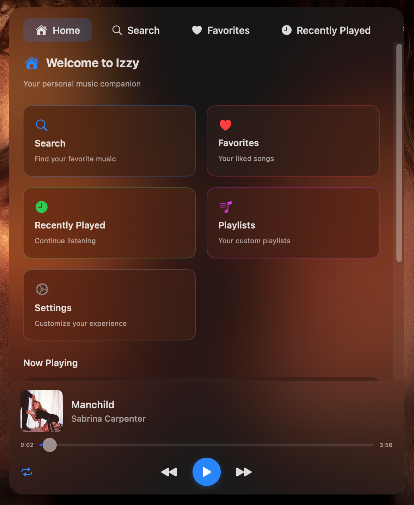

# Izzy - macOS Music Player with Spotlight-Like Interface

<div align="center">




A modern macOS music player with a beautiful Spotlight-like interface, featuring global hotkeys, YouTube Music integration, and seamless playback controls.


[](LICENSE)
[](https://developer.apple.com/macos/)
[](https://swift.org)
[](https://developer.apple.com/swiftui/)
[](LICENSE)

</div>

To support me, here is my UPI ID - kumar.shubham.6@superyes

## ✨ Features

### 🎵 **Music Playback**
- 🔍 **Real-time Search**: Search YouTube Music with intelligent suggestions
- 🎧 **High-Quality Streaming**: Stream music with adaptive quality selection
- 📱 **Media Controls**: Play, pause, skip with system-wide media key support
- 📜 **Recently Played**: Track and quickly access your music history
- 🔄 **Smart Library**: Organize your music with automatic categorization

### 🖥️ **User Interface**
- ✨ **Spotlight-Like Design**: Beautiful, familiar macOS search interface
- 🪟 **Floating Window**: Always accessible, appears above all applications
- 🎨 **Modern Aesthetics**: Blur effects, smooth animations, and native macOS styling
- 🌙 **Dark Mode Support**: Seamlessly adapts to system appearance
- ⌨️ **Keyboard Navigation**: Full keyboard control with intuitive shortcuts

### ⚡ **Global Features**
- 🔥 **Global Hotkey**: `Option + Space` to show/hide from anywhere
- 💾 **Persistent State**: Maintains search context and playback state
- 🎯 **Auto-Focus**: Search field automatically focused when shown
- 🔧 **System Integration**: Native macOS notifications and media center integration
- 🔄 **Auto-Updates**: Automatic update checking and installation

## 🚀 Quick Start

### Option 1: Download DMG (Recommended)
1. Download the latest `Izzy.dmg` from the [Releases](../../releases) page
2. Open the DMG file 
3. **Important Security Step**: Remove the quarantine attribute to avoid Gatekeeper warnings:
   ```bash
   xattr -rd com.apple.quarantine "/Applications/Izzy.app"
   ```
4. Drag Izzy to your Applications folder
5. Launch Izzy from Applications or Spotlight
6. Grant accessibility permissions when prompted
7. Press `Option + Space` to start using Izzy!

### Option 2: Build from Source
```bash
# Clone the repository
git clone https://github.com/your-username/izzy.git
cd izzy

# Open in Xcode
open Izzy.xcodeproj

# Build and run (⌘+R)
```

## 🔒 Security & Privacy Notice

When you download Izzy from the internet, macOS applies a "quarantine" attribute to protect your system. This may cause a warning when you first try to open the app. To resolve this:

### Remove Quarantine Attribute (Required for First Launch)
After installing Izzy to your Applications folder, run this command in Terminal:
```bash
xattr -rd com.apple.quarantine "/Applications/Izzy.app"
```

This command removes the quarantine attribute and allows macOS to run the app normally. You only need to do this once after installation.

### Why This Happens
macOS adds the `com.apple.quarantine` extended attribute to files downloaded from the internet as a security measure. While Izzy is safe and properly signed, this attribute triggers Gatekeeper warnings. Removing it tells macOS that you trust this application.

## Compatibility

Izzy is designed to work on modern macOS systems with the following requirements:

### System Requirements

- **Operating System**: macOS 14.0 (Sonoma) or later
- **Architecture**: Apple Silicon (M1/M2/M3) or Intel
- **Internet Connection**: Required for music streaming

## 🎯 Usage Guide

### Basic Operation
1. **Launch Izzy**: Open from Applications or use Spotlight search
2. **Global Access**: Press `Option + Space` from anywhere in macOS
3. **Search Music**: Type your search query in the search bar
4. **Select & Play**: Click on any result to start playback
5. **Control Playback**: Use the built-in controls or system media keys

### Keyboard Shortcuts
| Shortcut | Action |
|----------|--------|
| `Option + Space` | Show/Hide Izzy |
| `Escape` | Hide Izzy window |
| `↑ / ↓` | Navigate search results |
| `Enter` | Play selected track |
| `Space` | Play/Pause current track |
| `← / →` | Previous/Next track |
| `⌘ + ,` | Open preferences |
| `⌘ + Q` | Quit Izzy |

### Advanced Features
- **Recently Played**: Access your music history for quick replaying
- **Hover Controls**: Hover over recently played tracks to see remove options
- **Library Management**: Organize your music with categories and playlists
- **Search Filters**: Use advanced search operators for precise results
- **Auto-Updates**: Keep your app up to date with the latest features

## 🏗️ Architecture

### Core Components

```
┌─────────────────────────────────────────┐
│                IzzyApp                  │
│           Main App Entry Point          │
└─────────────────┬───────────────────────┘
                  │
┌─────────────────▼───────────────────────┐
│            AppCoordinator               │
│     Central App State Management        │
└─┬─────────┬─────────┬─────────┬────────┘
  │         │         │         │
  ▼         ▼         ▼         ▼
┌───────┐ ┌───────┐ ┌────────┐ ┌────────┐
│Global │ │Window │ │ Search │ │Playback│
│Hotkey │ │Manager│ │ State  │ │Manager │
│Manager│ │       │ │        │ │        │
└───────┘ └───────┘ └────────┘ └────────┘
```

### Key Classes

- **`AppCoordinator`**: Orchestrates app lifecycle and component interactions
- **`GlobalHotkeyManager`**: Handles system-wide keyboard shortcut registration
- **`WindowManager`**: Controls window behavior, positioning, and floating state
- **`SearchState`**: Manages search input, results, and UI state persistence
- **`PlaybackManager`**: Handles audio playback, queue management, and media controls
- **`MusicSearchManager`**: Interfaces with YouTube Music API for search functionality
- **`PythonServiceManager`**: Manages Python backend for music streaming services
- **`UpdateManager`**: Handles automatic update checking and installation

### Technologies Used

- **Swift 5.9+** with **SwiftUI** for native macOS UI
- **Carbon Framework** for global hotkey registration
- **AVFoundation** for audio playback
- **Python Backend** with `ytmusicapi` and `yt-dlp` for music streaming
- **UserDefaults** for settings and state persistence
- **Combine Framework** for reactive programming patterns

## 🛠️ Development Setup

### Prerequisites
```bash
# Install Xcode (from Mac App Store)
# Install Python dependencies
pip3 install ytmusicapi yt-dlp

# Verify Python installation
python3 --version  # Should be 3.8+
```

### Building the Project
```bash
# Clone and navigate to project
git clone https://github.com/your-username/izzy.git
cd izzy

# Install Python dependencies
pip3 install -r requirements.txt

# Open in Xcode
open Izzy.xcodeproj

# Configure code signing
# 1. Select your development team in project settings
# 2. Ensure bundle identifier is unique
# 3. Build and run (⌘+R)
```

### Creating a Release DMG
```bash
# Run the automated build script
./build_dmg.sh

# DMG will be created in dist/Izzy.dmg
# Size: ~896KB (highly optimized)
```

### Project Structure
```
Izzy/
├── Izzy/                          # Main app source
│   ├── IzzyApp.swift             # App entry point
│   ├── AppCoordinator.swift      # Main coordinator
│   ├── Views/                    # SwiftUI views
│   │   ├── MusicSearchView.swift
│   │   ├── PlaybackControlsView.swift
│   │   ├── RecentlyPlayedView.swift
│   │   └── LibraryView.swift
│   ├── Managers/                 # Business logic
│   │   ├── PlaybackManager.swift
│   │   ├── MusicSearchManager.swift
│   │   └── NowPlayingManager.swift
│   ├── Models/                   # Data models
│   │   └── MusicModels.swift
│   ├── Services/                 # External services
│   │   ├── PythonServiceManager.swift
│   │   └── UpdateManager.swift
│   └── Assets.xcassets/          # App resources
├── ytmusic_service.py            # Python backend
├── build_dmg.sh                  # Release build script
└── ExportOptions.plist           # Export configuration
```

## 🔄 Auto-Update System

Izzy includes an automatic update system that checks for new versions and notifies users when updates are available.

### How It Works
1. **Periodic Checks**: The app automatically checks for updates every 24 hours
2. **Manual Checks**: Users can manually check for updates in the Settings panel
3. **Update Notification**: When an update is available, users are notified
4. **Download & Install**: Users can download updates directly from the app

### Configuration
The update system is configured through:
- `update.json` file hosted on your web server
- Settings in `Info.plist`
- Update manager in `UpdateManager.swift`

### Hosting Updates
To provide updates for your users:
1. Host the `update.json` file on your web server
2. Update the file with new version information when releasing updates
3. Host the new DMG file at the specified download URL
4. Optionally host release notes at the specified URL

### Auto-Update Settings
Users can control the auto-update behavior through the Settings panel:
- Enable/disable automatic update checks
- Manually check for updates at any time
- Download and install updates when available

## 🎨 Customization

### Appearance Settings
```swift
// Modify these constants in the source code
struct AppConstants {
    static let searchBarHeight: CGFloat = 44
    static let windowWidth: CGFloat = 600
    static let windowHeight: CGFloat = 650
    static let cornerRadius: CGFloat = 20
}
```

### Hotkey Configuration
```swift
// Change global hotkey in GlobalHotkeyManager.swift
private let defaultHotkey = (keyCode: kVK_Space, modifiers: optionKey)
```

### Music Service Integration
The app uses a modular Python backend that can be extended to support additional music services:
```python
# ytmusic_service.py
def add_new_music_service():
    # Implement new music service integration
    pass
```

## 🔒 Privacy & Security

- **No Data Collection**: Izzy doesn't collect or transmit personal data
- **Local Storage Only**: All preferences stored locally using UserDefaults
- **Secure Streaming**: All music streams are fetched directly from sources
- **Sandboxed**: App runs in macOS sandbox environment
- **Code Signed**: All releases are properly code-signed for security

## 🤝 Contributing

We welcome contributions! Here's how to get started:

### Getting Started
1. Fork the repository
2. Create a feature branch: `git checkout -b feature/amazing-feature`
3. Make your changes and test thoroughly
4. Commit with clear messages: `git commit -m 'Add amazing feature'`
5. Push to your branch: `git push origin feature/amazing-feature`
6. Open a Pull Request with detailed description

### Development Guidelines
- Follow Swift style guidelines and SwiftUI best practices
- Write clear, commented code
- Test on both Apple Silicon and Intel Macs
- Ensure compatibility with macOS 15.5+
- Update documentation for any new features

### Bug Reports
Please use the issue tracker to report bugs. Include:
- macOS version and hardware details
- Steps to reproduce the issue
- Expected vs actual behavior
- Console logs if applicable

## 📄 License

This project is licensed under the MIT License - see the [LICENSE](LICENSE) file for details.

```
MIT License

Copyright (c) 2025 Izzy Music Player

Permission is hereby granted, free of charge, to any person obtaining a copy
of this software and associated documentation files (the "Software"), to deal
in the Software without restriction, including without limitation the rights
to use, copy, modify, merge, publish, distribute, sublicense, and/or sell
copies of the Software, and to permit persons to whom the Software is
furnished to do so, subject to the following conditions:

The above copyright notice and this permission notice shall be included in all
copies or substantial portions of the Software.

THE SOFTWARE IS PROVIDED "AS IS", WITHOUT WARRANTY OF ANY KIND, EXPRESS OR
IMPLIED, INCLUDING BUT NOT LIMITED TO THE WARRANTIES OF MERCHANTABILITY,
FITNESS FOR A PARTICULAR PURPOSE AND NONINFRINGEMENT.
```

## 🙏 Acknowledgments

- **YouTube Music API**: For providing music search and streaming capabilities
- **yt-dlp**: For robust video/audio extraction
- **SwiftUI**: For enabling beautiful native macOS interfaces
- **Carbon Framework**: For system-wide hotkey functionality
- **macOS Community**: For inspiration and development resources

## 📞 Support

- **Issues**: [GitHub Issues](../../issues)
- **Discussions**: [GitHub Discussions](../../discussions)

---

<div align="center">

Made with ❤️ for the macOS community

**[Download Latest Release](../../releases/latest)** • **[View Documentation](../../wiki)** • **[Report Issues](../../issues)**

</div>